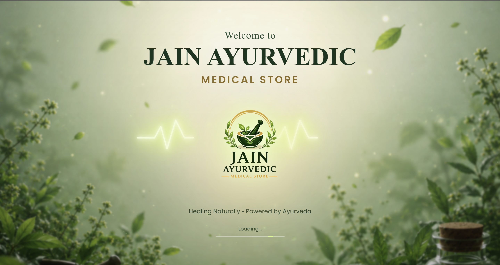
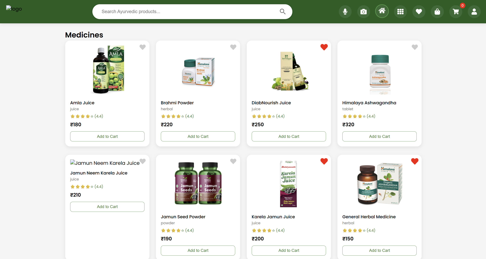
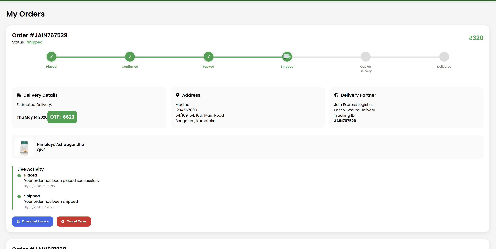
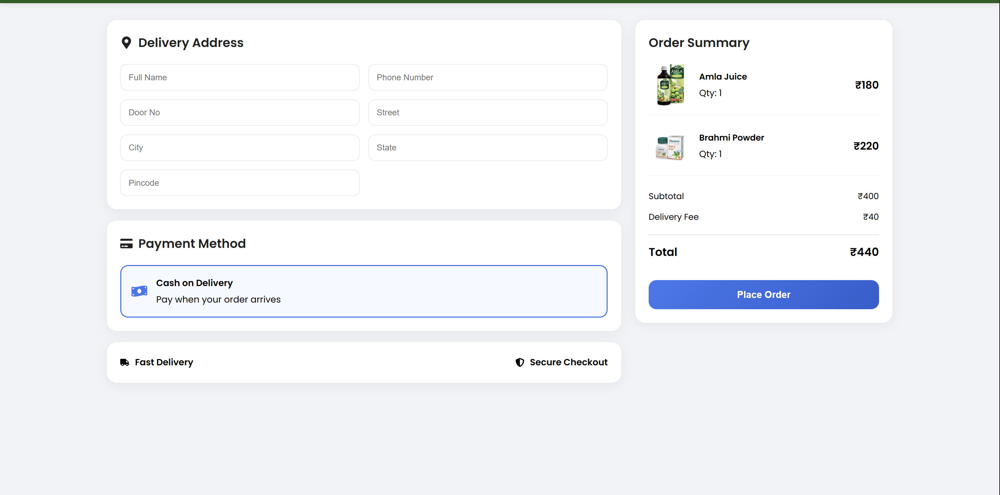

# JAIN AYURVEDIC STORE

A Full Stack Ayurvedic E-Commerce Web Application built using MERN Stack.

---

# 🚀 Tech Stack

## Frontend
- React.js
- React Router DOM
- Axios
- React Hot Toast

---

## Backend
- Node.js
- Express.js
- MongoDB
- Mongoose
- Express Session

---

# ✨ Features

## User Features
- User Authentication
- Product Search
- Wishlist
- Cart
- Save For Later
- Order Tracking
- Checkout

---

## Order Features
- Delivery OTP
- Tracking Timeline
- Estimated Delivery
- Email Notifications

---


# Screenshots

## Website Loading Animation Page




## Home Page



## Cart Page



## Checkout




# 📦 Installation

## Frontend

```bash
cd client
npm install
npm run dev
```

## Backend

```bash
cd server
npm install
npm start
```

---

# 🔐 Environment Variables

Create `.env` file in server folder.

Example:

```env
PORT=5000

MONGO_URI=your_mongodb_url

SESSION_SECRET=your_secret

EMAIL_USER=your_email

EMAIL_PASS=your_password
```

---

## 📌 Current Development Stage

The project is currently in a stable and functional MVP+ phase and is successfully deployed for testing and demonstration purposes.

### Completed Features

#### User Module

* User Registration & Login Authentication
* Product Search and Filtering
* Wishlist Management
* Shopping Cart
* Save For Later Functionality
* Checkout System
* Order History
* Order Tracking

#### Order Management

* Delivery OTP Verification
* Order Timeline Tracking
* Estimated Delivery Tracking
* Invoice PDF Download
* Order Cancellation

#### Admin Module

* Admin Dashboard
* Product Management
* Order Management
* Stock/Inventory Management
* Order Status Updates
* Delivery Monitoring

#### Notifications

* Order Placed Email Notifications
* Shipped Email Notifications
* Out For Delivery Notifications
* Delivered Notifications
* Real-Time Order Status Updates

#### Media & Storage

* Cloudinary Image Upload Integration
* Product Image Management

#### Deployment

* Frontend deployed on Vercel
* Backend deployed on Render
* MongoDB Cloud Database Integration

### Current Platform Capabilities

* Fully functional e-commerce workflow
* Responsive user interface
* Real-time order management
* Inventory tracking
* Secure session-based authentication
* Cloud image storage
* Automated invoice generation
* Email notification system

## 📌 Project Status: Actively Maintained & Under Continuous Enhancement


# 🚀 Future Improvements

## Payments & Delivery

* Razorpay Payment Gateway Integration
* Online Payment Tracking
* Payment History Dashboard
* Refund & Return Management
* SMS Notification Integration (MSG91)

---

## Advanced Customer Experience

* AI-Powered Ayurvedic Assistant
* Medicine Recommendation System
* ChatGPT-Based Health Query Support
* Personalized Product Suggestions
* Smart Search with AI

---

## Location & Delivery Enhancements

* Google Maps Integration
* Store Location Mapping
* Live Delivery Tracking
* Delivery Partner Dashboard
* Delivery Route Optimization

---

## Analytics & Business Growth

* Advanced Admin Analytics Dashboard
* Revenue Reports
* Sales Insights
* Best Selling Products Analysis
* Customer Behavior Analytics
* Inventory Forecasting

---

## Enterprise Features

* Multi-Admin Support
* Role-Based Access Control
* Supplier Management
* Purchase Order Management
* Warehouse Management

---

## Customer Engagement

* Product Reviews & Ratings
* Loyalty Rewards Program
* Coupon & Discount System
* Referral Program
* Push Notifications

---

## Long-Term Vision

Transform Jain Ayurvedic Store into a modern digital healthcare commerce platform that combines traditional Ayurvedic products with AI-powered assistance, intelligent recommendations, seamless delivery management, and data-driven business analytics.
---

# Author

Developed by Madiha